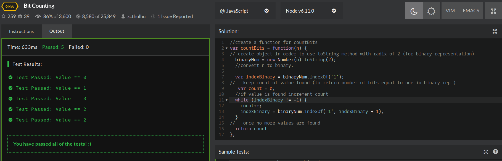

## CodeWars Challenge- 19

*Description:*
Complete the function circleArea so that it will return the area of a circle with the given radius. Round the returned number to two decimal places (except for Haskell). If the radius is not positive or not a number, return false.

*Test Cases:*

1. Test.assertEquals(countBits(0), 0);
2. Test.assertEquals(countBits(4), 1);
3. Test.assertEquals(countBits(7), 3);
4. Test.assertEquals(countBits(9), 2);
5. Test.assertEquals(countBits(10), 2);

## Languages Used

1. JavaScript

## Takeaway:

This was an extremely challenging kata. First I researched how to convert a number to it's binary representation, I found that creating a Number Object would allow me to use the toString() method while passing in a radix which returns the binary representation of a number. At this point if I passed in the number 126 I'd return : 1111110. I then use the indexOf() method and pass in "1" in order to count each "1" found in the binary representation.

Learning how to use the indexOf() method I realized that if the value is not found a -1 is returned and so I used this as my boolean value, while a value is found the return is the position of the value found and so we continue counting. I then have to start from the next position and so indexBinary is set to search for "1" starting at the next position (by incrementing by 1).
